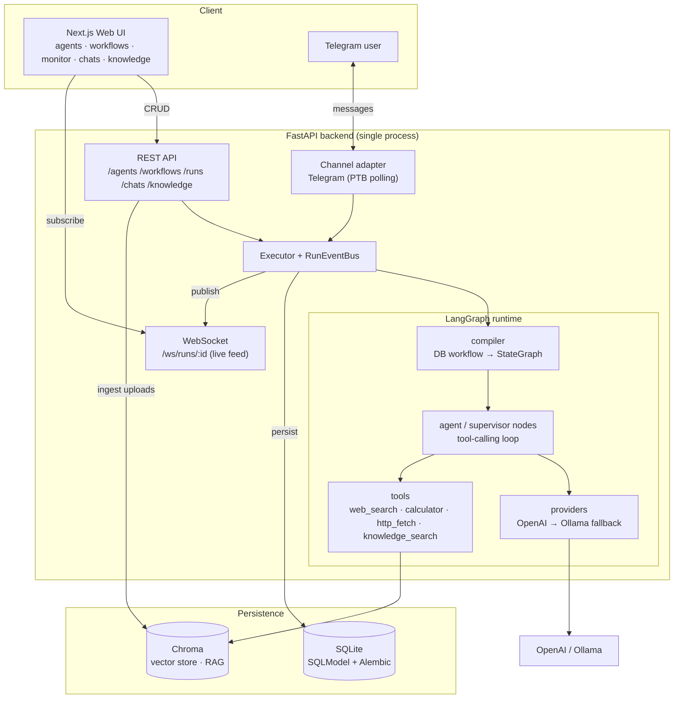

# AI Agent Orchestration Platform

Build configurable AI agents, connect them into collaborative multi-agent **workflows**, run them on
a **real runtime** (LangGraph) that executes real tools, watch them work in a **live monitor**, and
talk to an agent through an **external messaging channel** (Telegram). Everything is managed from a
visual web UI and **runs fully local with a single command**.

---

## Demo

📹 _Recorded walkthrough: **[link to your video/gif]**_ — create agents → run a 2-agent workflow →
live monitor (logs, inter-agent messages, token/cost) → a live Telegram conversation with an agent.

---

## Architecture



**The DB row is the source of truth.** A workflow is stored as nodes + edges; on every run the
compiler materializes it into a fresh LangGraph `StateGraph`. The runtime executes the real agent
logic (custom LLM + tool-calling loop, supervisor routing, conditional edges, feedback loops),
persists every message/event/token-cost, and publishes a live feed to the WebSocket. The Telegram
bot shares the same backend process and the same run pipeline — it is not a separate service.

### Layer separation (UI ↔ runtime ↔ persistence)
| Layer | Where | Responsibility |
|---|---|---|
| **UI** | `frontend/` | Visual management + live monitoring. Never talks to the DB; only REST + WS. |
| **Runtime** | `backend/runtime/` | Compiles + executes graphs, calls LLMs/tools, emits events. |
| **Persistence** | `backend/models.py` + Alembic | SQLite schema (agents, workflows, runs, messages, events…). |
| **Channels** | `backend/channels/` | Pluggable external transports (Telegram); routing isolated from transport. |

### Why LangGraph (runtime justification)
The platform needs **graph-native multi-agent orchestration**: supervisor/worker routing,
**conditional edges**, and **cycles (feedback loops)** — plus streaming for live monitoring.
LangGraph models exactly this as a `StateGraph` with conditional edges and a recursion limit, and its
streaming maps cleanly onto our WebSocket feed. Alternatives were heavier or less graph-native for our
needs: **CrewAI** is role/task-oriented (less explicit graph control over conditional cycles),
**AutoGen** centers on conversational agent groups (more wiring for a DB-defined visual graph). We use
a **custom agent node loop** (not `create_react_agent`) so we control the OpenAI→Ollama fallback,
per-message token/cost instrumentation, and `limits`/`guardrails` enforcement. The LangGraph
checkpointer is deferred (runs are short and fully persisted to SQLite).

---

## Tech stack
| Layer | Technology |
|---|---|
| Frontend | Next.js 16 (App Router) · React 19 · TypeScript · Tailwind v4 · shadcn/ui · React Flow (`@xyflow/react`) · TanStack Query · Recharts · framer-motion |
| Backend | FastAPI · Python 3.12 · asyncio · Uvicorn |
| AI runtime | LangGraph · LangChain |
| LLM providers | OpenAI (`gpt-4.1-mini`/`-nano`, `gpt-5-nano`, `gpt-4o-mini`) → Ollama local fallback · deterministic fake for offline tests |
| Persistence | SQLite + SQLModel (async, aiosqlite) · Alembic migrations · Chroma (RAG vectors) |
| Channel | python-telegram-bot (polling, in-process) |

Language/stack rationale: **Python** backend to sit natively in the LangGraph/LangChain ecosystem;
**Next.js + React Flow** front end because the core UX is a visual graph editor + live streaming.

---

## Quickstart

### Option A — Docker (one command) ✅ recommended
```bash
# optional: add your keys (the app also runs without them)
cp backend/.env.example backend/.env       # then set OPENAI_API_KEY / TELEGRAM_TOKEN

docker compose up --build
```
- **Web UI:** http://localhost:3000
- **API + Swagger:** http://localhost:8000/docs

Migrations run automatically on startup, and **two workflow templates are seeded** so the app is
usable immediately. Data persists in the `yuno-data` volume — see **Configuration & common commands** below.

### Option B — run the services directly
**Backend** (requires Python 3.11+; verified on 3.12):
```bash
cd backend
python -m venv .venv && .\.venv\Scripts\Activate.ps1   # Windows PowerShell
pip install -r requirements.txt
uvicorn main:app --reload                               # :8000  (migrations + seed run on startup)
```
**Frontend** (Node 18+; verified on Node 22):
```bash
cd frontend
npm install
npm run dev                                             # :3000
```
No API keys? Set `USE_FAKE_LLM=true` in `backend/.env` for a fully offline, deterministic runtime.

---

## Configuration & common commands

All settings live in `backend/.env` (copy `backend/.env.example`). Everything has a sensible default —
these are the ones you'll actually touch:

| Setting | What it does |
|---|---|
| `OPENAI_API_KEY` | Your OpenAI key — agents on a `gpt-*` model use it. |
| `OPENAI_MODEL` | Model used when an agent leaves its model blank (e.g. `gpt-4.1-mini`). |
| `USE_FAKE_LLM` | `true` runs fully offline with a deterministic fake LLM (no key needed). |
| `TELEGRAM_TOKEN` | Bot token from @BotFather — set it to turn on the Telegram bot. |
| `OLLAMA_BASE_URL` | Point at a local Ollama server to use it as the offline fallback. |
| `RAG_TOP_K` | How many knowledge snippets `knowledge_search` returns (default `4`). |

Token usage and cost are tracked automatically for every run and shown live in the monitor. OpenAI
prices come from a built-in table; you can override any rate in `.env` with `OPENAI_PRICE_OVERRIDES`.

**Docker commands:**

```bash
docker compose up --build       # build + start everything
docker compose logs -f backend  # follow the backend logs
docker compose down             # stop everything
docker compose down -v          # stop and wipe all data (database + vectors)
```

To use a local model as the fallback: run Ollama, set `OLLAMA_BASE_URL=http://host.docker.internal:11434`
in `backend/.env`, and pull a model — `ollama pull qwen2.5 nomic-embed-text`.

---

## Using the application (end-to-end)

Everything below happens in the web UI at **http://localhost:3000**.

1. **Agents** (`/agents`) — create an agent, or use a seeded one (*Researcher*, *Writer*,
   *Supervisor*). Configure its **role, model, system prompt, and tools** (e.g. `web_search`), plus
   optional memory, skills, interaction rules, guardrails, and limits. Save.
2. **Workflows** (`/workflows`) — open a seeded **template** (*Research → Write* or
   *Supervisor + Workers*), or build your own on the canvas: drag agents in, **connect them with
   edges** (give an edge a *condition* for LLM-judged routing; draw an edge back to a previous node
   for a feedback loop), mark one node as the **entry**, then **Save**.
3. **Run it** — click **Run** on the workflow (unsaved edits auto-save first), or go to
   **Runs → New run**, pick the workflow, and type a task
   (e.g. *"Research the latest on … and write a short summary."*).
4. **Watch the live monitor** (`/runs/[id]`) — events/logs, **inter-agent messages** (who handed off
   to whom, including tool calls + results), and **token/cost** stream in real time; the final result
   appears when the run completes.
5. **Chats** (`/chats`) — start a chat bound to a workflow for a **multi-turn conversation**; each
   chat keeps its own memory.
6. **Knowledge** (`/knowledge`) — drag-and-drop `.txt/.md/.pdf` documents into the RAG knowledge
   base. Any agent with the `knowledge_search` tool can then search them — no terminal, no restart.
7. **Telegram** (if `TELEGRAM_TOKEN` is set) — message your bot, send **`/workflows`** and tap one
   (or **`/use <id>`**) to pick a workflow, then just send a message to run it. The reply includes the
   run's token/cost; `/current` shows the selection and `/clear` resets it.

> Switch light/dark from the sidebar. With no LLM key, set `USE_FAKE_LLM=true` and the whole flow
> still works end-to-end (deterministic offline runtime).

---

## Features → challenge success criteria
| Requirement | Where |
|---|---|
| Agent CRUD (name, role, prompt, model, tools, channels) | Agents page + `POST/PUT /agents` |
| Agent config (schedules, memory, skills, interaction rules, guardrails, limits) | Agent config form |
| Visual workflow builder with **conditions + feedback loops** | React Flow canvas (`/workflows/[id]`) |
| **≥2 pre-built workflow templates** | seeded on startup — *Research → Write*, *Supervisor + Workers* (`backend/seed.py`) |
| Real runtime executes agent logic (not a mockup) | LangGraph (`backend/runtime/`) |
| Agents communicate asynchronously; history persisted + visible | shared graph state + `messages` table + live monitor |
| External channel (≥1 agent reachable) | Telegram bot (`backend/channels/`) |
| Live monitoring: real-time logs, inter-agent messages, token/cost | `WS /ws/runs/:id` + the monitor UI |
| Single local setup command | `docker compose up --build` |
| Tests for critical paths | `backend` 62 tests · `frontend` 12 tests |

---

## How agents use tools (LLM tool-calling)

Tools are **opt-in per agent** — only the tools listed on an agent are bound to its model for a run.
On each step the runtime binds those tools to the LLM (`model.bind_tools`), the model decides whether
to call one, and the agent node runs a **tool-calling loop**:

1. The LLM replies with either a final answer **or** one or more **tool calls** (name + JSON args).
2. The runtime executes each tool and feeds the **result** back to the model.
3. This repeats until the model stops calling tools or the agent's **`max_steps`** limit is reached.

Every tool call **and its result** is persisted and streamed to the live monitor as a `tool_call`
event (args, result, status, duration). `guardrails.allowed_tools_only` keeps an agent to exactly its
configured tools.

| Tool | What it does | Input | Notes |
|---|---|---|---|
| `web_search` | Web search; returns the top results (title, snippet, URL) | `query` | DuckDuckGo — **keyless** |
| `calculator` | Evaluates basic arithmetic (`+ - * / ** % //`, parentheses) | `expression` | Safe AST evaluation (no `eval`) |
| `http_fetch` | HTTP `GET`s a URL and returns the body text (≤ 4000 chars) | `url` | Follows redirects |
| `knowledge_search` _(alias `rag`)_ | Retrieves relevant snippets from your ingested docs | `query` | RAG over a local Chroma store — see below |

> Reliable tool-calling needs a capable model: OpenAI `gpt-*` models and tool-capable local models
> (`qwen2.5`, `llama3.1`) work well; very small or reasoning-only local models often won't call tools.

---

## RAG — knowledge base ingestion

Give agents private knowledge through the **`knowledge_search`** tool, backed by a **local Chroma**
vector store — everything stays on your machine.

**1. Add your documents** (`.txt`, `.md`, `.pdf`) — two ways:

- **From the UI (easiest):** open the **Knowledge** page and drag files in. They're ingested right
  away, listed with their chunk counts, and removable with one click — no terminal, no restart.
- **From the CLI:** drop files into `backend/knowledge/` (or any folder) and run from `backend/`:
  ```bash
  python -m runtime.ingest knowledge              # a whole folder (recursive)
  python -m runtime.ingest my_docs/handbook.pdf   # …or a single file
  ```

Each document is split into ~1000-character overlapping chunks, embedded (OpenAI
`text-embedding-3-small` → Ollama `nomic-embed-text` → an offline fake), and upserted into Chroma.
Re-ingesting a file **refreshes** its chunks, so keeping documents up to date is a one-liner.

**2. Let an agent use it.** Add `knowledge_search` to the agent's **Tools** and prompt it to consult
the knowledge base. At run time the agent retrieves the most relevant snippets and answers with
`[source: <file>]` citations — visible as a `tool_call` in the live monitor.

> Keep the embedding provider the same between ingesting and running. Chunk size, top-K, and the
> embedding model are configurable in `backend/.env`.

---

## Project structure
```
backend/
  main.py            FastAPI app (lifespan: migrations → seed → channels)
  models.py          SQLModel schema      alembic/  migrations
  seed.py            pre-built agents + workflow templates (idempotent)
  routers/           REST + WS endpoints
  runtime/           LangGraph: compiler · nodes · providers · tools · rag · executor · eventbus
  channels/          pluggable external channels (base · manager · telegram · service)
frontend/
  app/               App Router pages (agents · workflows · runs · chats · knowledge)
  components/        UI primitives + workflow canvas + live monitor
  lib/               typed API client · queries · WS hook · formatters
design-system/yuno/MASTER.md   the locked design language
```

---

## How to add a new workflow template
Templates are ordinary workflows flagged `is_template=True`, seeded idempotently in
[`backend/seed.py`](backend/seed.py).

1. In `seed_templates()`, reuse/`_get_or_create_agent(...)` for the agents the template needs.
2. Call `_create_template(...)` with a unique `name`, the `entry` node key, the `nodes`
   (`node_key`, agent, `NodeType.agent`/`supervisor`, x, y), and `edges`
   (`source`, `target`, optional `condition`). A node with multiple conditioned out-edges routes via
   an LLM; a `supervisor` node routes via its decision; a single out-edge is a static edge; edges back
   to an earlier node form a feedback loop.
3. Restart the backend — re-seeding is safe (it skips templates that already exist).

Templates also surface in the UI (the **template** badge on the Workflows page); you can equally build
one visually in the workflow builder and toggle it as a template via the API.

## How to add a new messaging channel (e.g. Slack / WhatsApp)
Transport and routing are separated, so a new provider is just a new adapter:

1. Implement the small [`ChannelAdapter`](backend/channels/base.py) interface
   (`provider`, `start()`, `stop()`, `send(chat_id, text)`) in `backend/channels/<provider>.py`.
   Inbound messages should call the shared `ChannelService` (see `channels/service.py`) so
   routing/persistence/run-triggering stays identical to Telegram.
2. Register it in `channels/manager.py` → `_build_adapters()` (start it only when its credentials
   are configured, like the Telegram check).
3. Add its credentials to `config.py` (settings) and `.env.example`. The lifespan starts/stops all
   configured adapters automatically; a misbehaving channel never crashes the API.

---

## Testing
```bash
cd backend && pytest          # 62 tests, fully offline (USE_FAKE_LLM)
cd frontend && npm test       # 12 tests (Vitest + React Testing Library)
```
Critical paths covered: agent creation, workflow execution, message delivery, the live WS stream,
provider routing/pricing, template seeding, and knowledge-base upload.

---

## Key design decisions
- **DB row is the source of truth** — the workflow graph compiles to a LangGraph `StateGraph` per run.
- **Name-routed LLM provider** — `gpt-*`/`o*` → OpenAI, else local Ollama; automatic fallback on error.
- **WebSocket is the single source of truth for live run state** — the UI never polls REST for an
  in-progress run.
- **The Telegram bot shares the FastAPI process** — same runtime, same persistence, not a side service.
- **One-command local run** — Alembic auto-migrates + templates auto-seed on startup.
